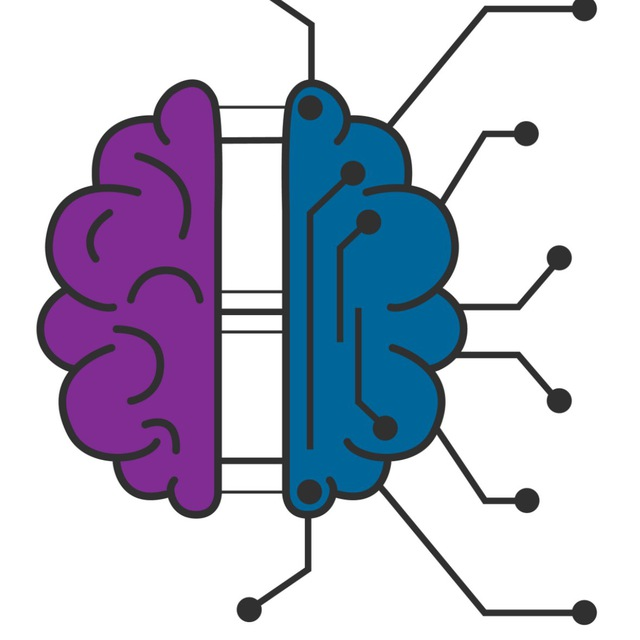

# Grupo de estudos em Inteligência Artificial

<!-- LOGO -->
 

  

Repositório com material utilizado no grupo de estudos do ramo estudantil IEEE UFBA

## Conteúdo Programático: 

### Módulo 1 - Machine learning

#### Introdução as ferramentas
- [X] Gestão de pacotes e criação de ambientes virtuais em python (Anacodna / PIP)
- [X] Bibliotecas essencais - NumPy
- [X] Bibliotecas essencais - Pandas
- [X] Tratamento de dados Numéricos / Categóricos
#### Introdução as técnicas 
- [X] Regressão Linear
- [X] Classificação Máquina de Vetor de Suporte(SVM)
- [X] Clustering (K - Means)
#### Projetos Praticos
- [ ] Regressão
- [ ] Classificação

## Contribuindo 

1. Faça o _fork_ do projeto (<https://github.com/Skyzenho/ArtIEEEficiais/fork>)
2. Crie uma _branch_ para sua modificação (`git checkout -b feature/fooBar`)
3. Faça o _commit_ (`git commit -am 'Add some fooBar'`)
4. _Push_ (`git push origin feature/fooBar`)
5. Crie um novo _Pull Request_
